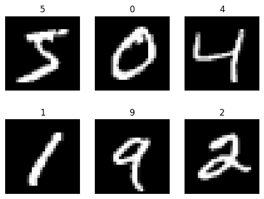
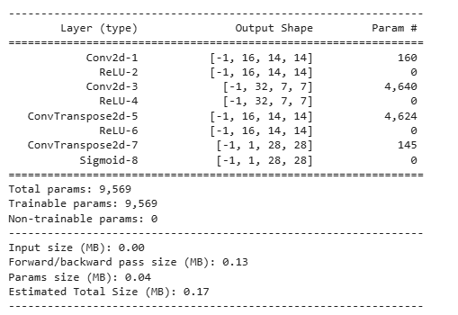
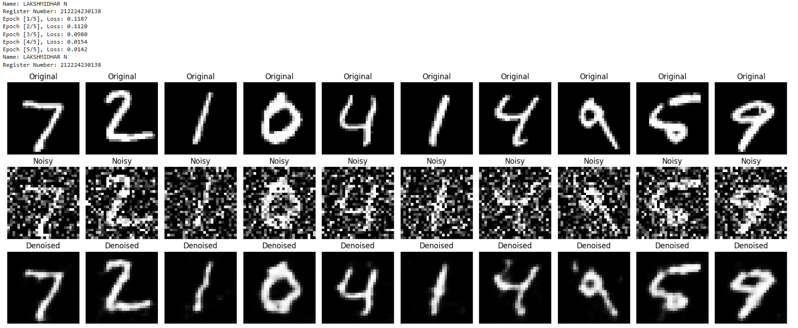

# DL- Convolutional Autoencoder for Image Denoising

## AIM
To develop a convolutional autoencoder for image denoising application.

## Problem Statement and Dataset

### Problem Statement

To design and implement a Denoising Autoencoder using PyTorch that learns to reconstruct clean images from noisy input images using the MNIST dataset. The model should encode the input image into a compressed representation and then decode it to remove noise and reconstruct the original image. The performance of the model is evaluated by comparing the original, noisy, and denoised images.


### Dataset



## DESIGN STEPS
### STEP 1: 

Start the program and import the required libraries such as PyTorch, NumPy, Matplotlib, and other dependencies.

### STEP 2: 

Load the MNIST dataset and apply preprocessing transformations. Add noise to the input images to create noisy images for training the denoising autoencoder.

### STEP 3: 

Define the Denoising Autoencoder model with an encoder (Conv2D layers) to compress the image and a decoder (ConvTranspose2D layers) to reconstruct the original image.

### STEP 4: 

Train the model by passing the noisy images through the autoencoder, calculating the reconstruction loss using Mean Squared Error (MSE), and updating the model parameters using the Adam optimizer.

### STEP 5: 

Evaluate and visualize the results by displaying the original images, noisy images, and denoised reconstructed images to observe how well the model removes noise.


## PROGRAM

### Name: LAKSHMIDHAR N

### Register Number: 212224230138

```python
# Autoencoder Definition
class DenoisingAutoencoder(nn.Module):
    def __init__(self):
        super(DenoisingAutoencoder, self).__init__()
        self.encoder = nn.Sequential(
            nn.Conv2d(1, 16, kernel_size=3, stride=2, padding=1), nn.ReLU(),
            nn.Conv2d(16, 32, kernel_size=3, stride=2, padding=1),nn.ReLU())

        self.decoder = nn.Sequential(
            nn.ConvTranspose2d(32, 16, kernel_size=3, stride=2, output_padding=1, padding=1),nn.ReLU(),
            nn.ConvTranspose2d(16, 1, kernel_size=3, stride=2, output_padding=1, padding=1),nn.Sigmoid())

    def forward(self, x):
        x = self.encoder(x)
        x = self.decoder(x)
        return x

# Initialize model, loss function and optimizer
model = DenoisingAutoencoder().to(device)
criterion =nn.MSELoss()
optimizer = optim.Adam(model.parameters(), lr=1e-3, weight_decay=1e-3)

# Train the Autoencoder
def train(model, loader, criterion, optimizer, epochs=10):
    model.train()

    print("Name: Junjar U")
    print("Register Number: 212224230110")

    for epoch in range(epochs):
        running_loss = 0.0
        for images, _ in loader:
            images = images.to(device)
            noisy_images = add_noise(images).to(device)

            outputs = model(noisy_images)
            loss = criterion(outputs, images)

            optimizer.zero_grad()
            loss.backward()
            optimizer.step()

            running_loss += loss.item()

        print(f"Epoch [{epoch+1}/{epochs}], Loss: {running_loss/len(loader):.4f}")

# Evaluate and visualize
def visualize_denoising(model, loader, num_images=10):
    model.eval()
    with torch.no_grad():
        for images, _ in loader:
            images = images.to(device)
            noisy_images = add_noise(images).to(device)
            outputs = model(noisy_images)
            break

    images = images.cpu().numpy()
    noisy_images = noisy_images.cpu().numpy()
    outputs = outputs.cpu().numpy()

    print("Name: Junjar U")
    print("Register Number: 212224230110")
    plt.figure(figsize=(18, 6))
    for i in range(num_images):
        # Original
        ax = plt.subplot(3, num_images, i + 1)
        plt.imshow(images[i].squeeze(), cmap='gray')
        ax.set_title("Original")
        plt.axis("off")

        # Noisy
        ax = plt.subplot(3, num_images, i + 1 + num_images)
        plt.imshow(noisy_images[i].squeeze(), cmap='gray')
        ax.set_title("Noisy")
        plt.axis("off")

        # Denoised
        ax = plt.subplot(3, num_images, i + 1 + 2 * num_images)
        plt.imshow(outputs[i].squeeze(), cmap='gray')
        ax.set_title("Denoised")
        plt.axis("off")

    plt.tight_layout()
    plt.show()


```

### OUTPUT

### Model Summary



### Training loss

## Original vs Noisy Vs Reconstructed Image



## RESULT
The denoising autoencoder successfully removes noise and reconstructs clean MNIST digit images.
